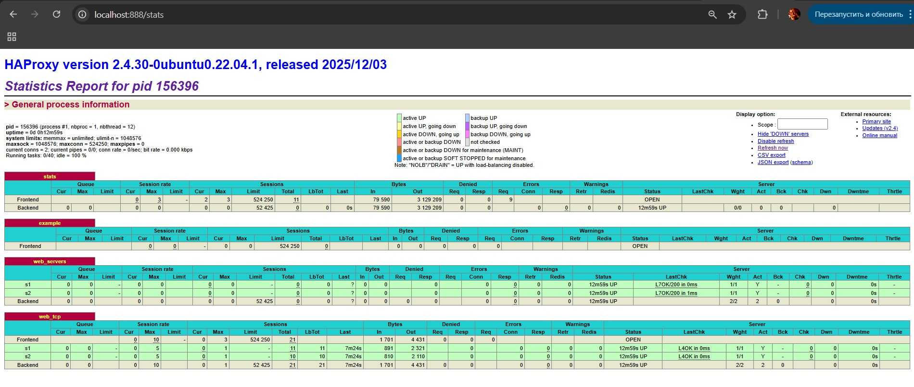
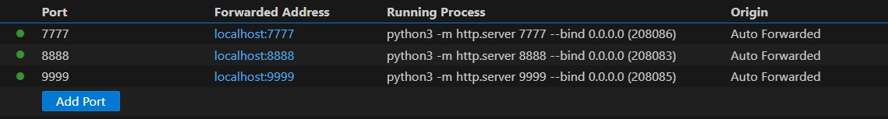
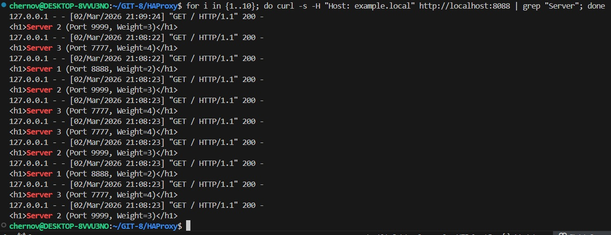
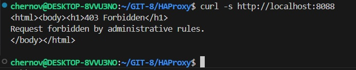
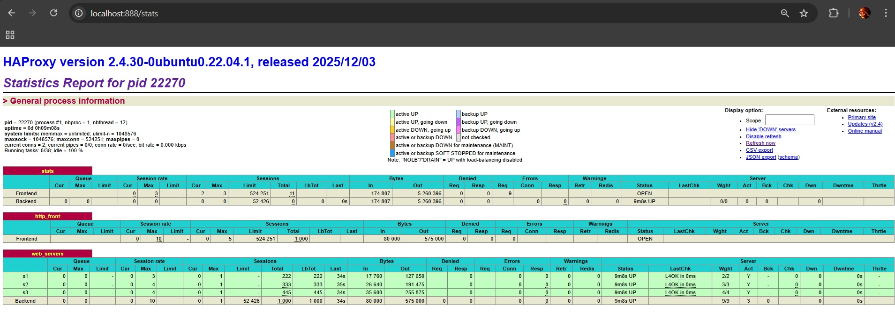

# Домашнее задание к занятию "`«Кластеризация и балансировка нагрузки»`" - `Chernov Vyacheslav`


## Задание 1 
### Запустите два simple python сервера на своей виртуальной машине на разных портах
### Установите и настройте HAProxy, воспользуйтесь материалами к лекции по ссылке
### Настройте балансировку Round-robin на 4 уровне.
### На проверку направьте конфигурационный файл haproxy, скриншоты, где видно перенаправление запросов на разные серверы при обращении к HAProxy.

```
mkdir server1 && cd server1
echo "<h1>Server 1 (Port 8888)</h1>" > index.html
python3 -m http.server 8888

mkdir server2 && cd server2
echo "<h1>Server 2 (Port 9999)</h1>" > index.html
python3 -m http.server 9999
```

```
sudo apt update
sudo apt install haproxy -y
```




- [Конфиг HAProxy для задания 1](txt/1.txt)

## Задание 2
### Запустите три simple python сервера на своей виртуальной машине на разных портах
### Настройте балансировку Weighted Round Robin на 7 уровне, чтобы первый сервер имел вес 2, второй - 3, а третий - 4
### HAproxy должен балансировать только тот http-трафик, который адресован домену example.local
### На проверку направьте конфигурационный файл haproxy, скриншоты, где видно перенаправление запросов на разные  серверы при обращении к HAProxy c использованием домена example.local и без него. 

```
mkdir server1 && cd server1
echo "<h1>Server 1 (Port 8888, Weight=2)</h1>" > index.html
python3 -m http.server 8888

mkdir server2 && cd server2
echo "<h1>Server 1 (Port 9999, Weight=3)</h1>" > index.html
python3 -m http.server 9999

mkdir server3 && cd server3
echo "<h1>Server 1 (Port 8888, Weight=4)</h1>" > index.html
python3 -m http.server 7777
```









- [Конфиг HAProxy для задания 2](txt/2.txt)
